<div align="center">

**简体中文** | [English](./README.en-US.md) | [日本語](./README.ja-JP.md)

# XnetDataops Web

**XnetDataops 数据工程与治理平台的 Web 控制台**

[](http://www.xnetdataops.synapxnet.cn) [](https://vuejs.org/) [](https://www.typescriptlang.org/) [](./LICENSE)

[在线体验](http://www.xnetdataops.synapxnet.cn) · [后端仓库 XnetDataops](https://github.com/synapxnet/XnetDataops) · [OpenXnet 开源社区](https://openxnet.synapxnet.com) · [查看许可](./LICENSE)

</div>

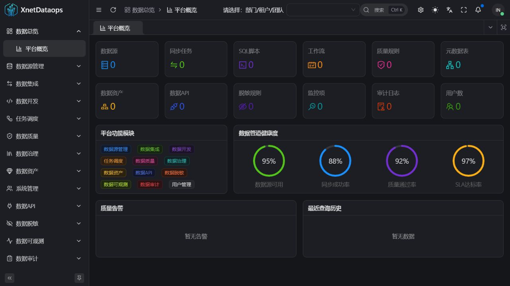

## 页面预览

| 演示登录 | 数据源配置 |
| --- | --- |
|  | 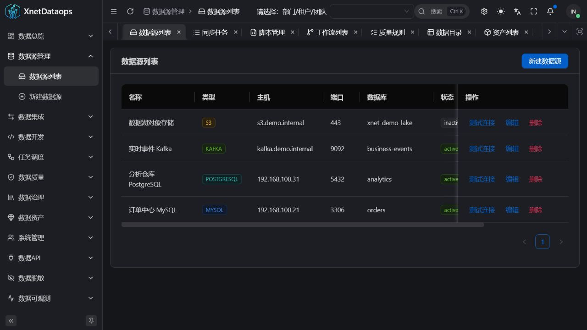 |
| 数据同步 | SQL 工作台 |
|  | 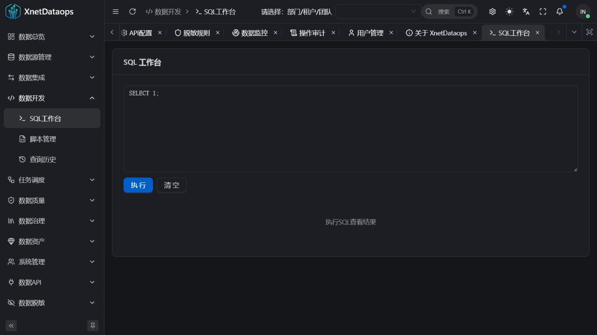 |
| 工作流调度 | 数据质量 |
| 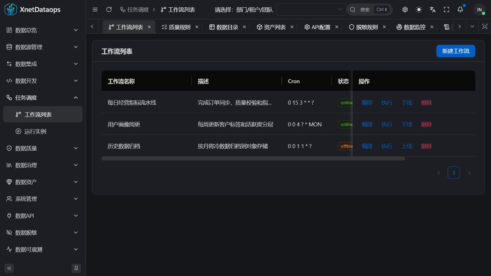 |  |
| 数据血缘 | 数据 API |
| 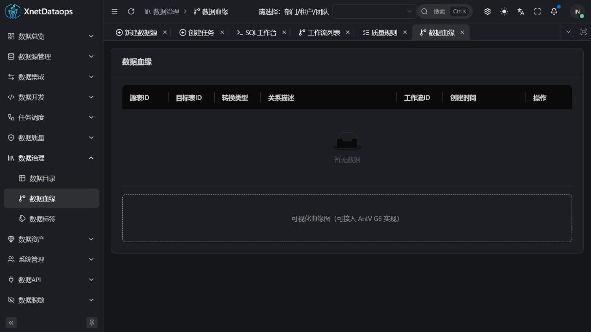 | 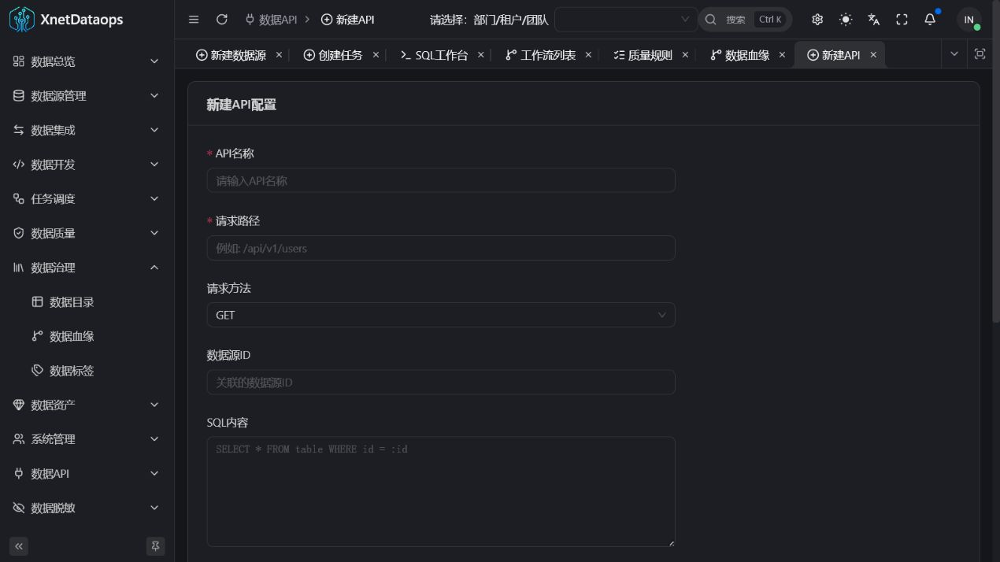 |
| 数据脱敏 | 数据可观测 |
| 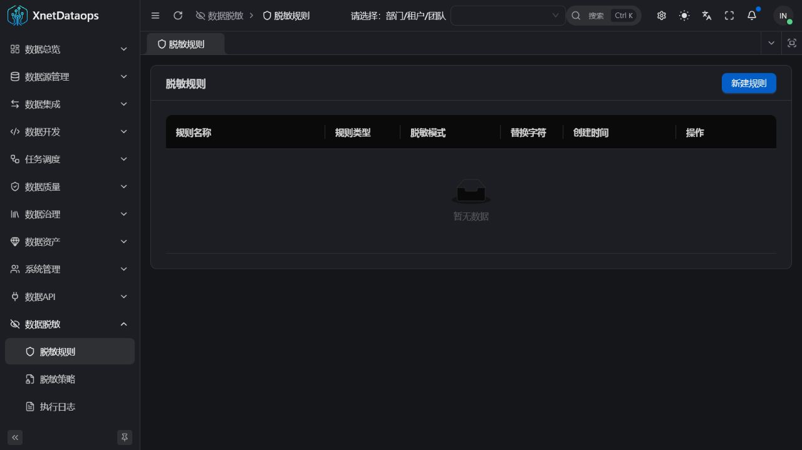 | 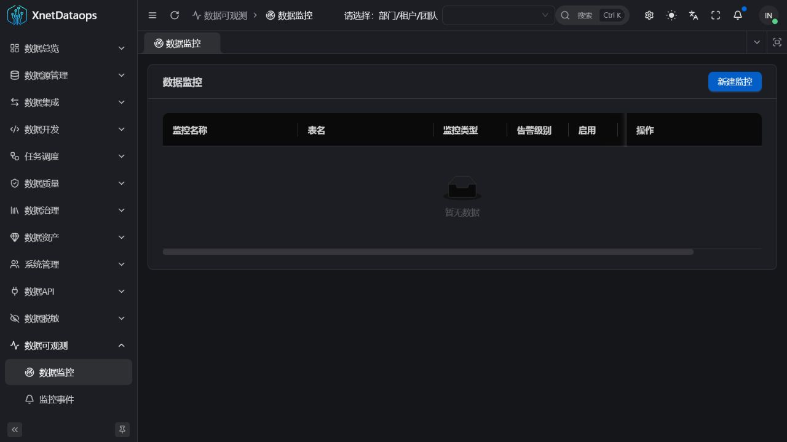 |
| 操作审计 | 关于项目 |
| 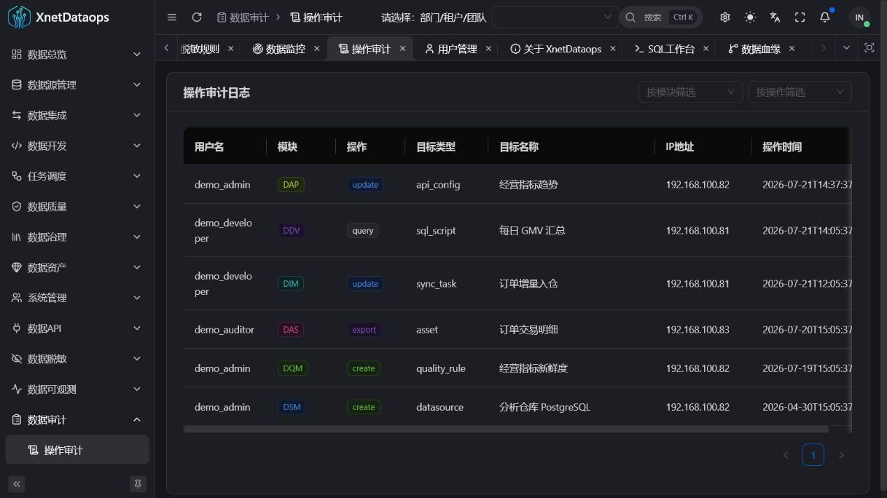 | 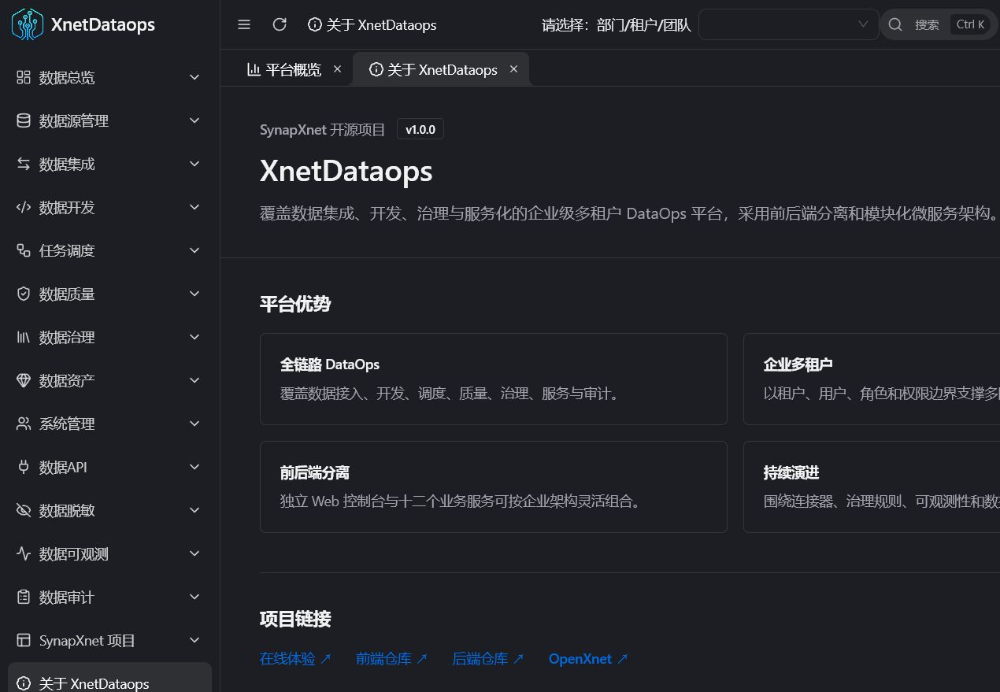 |

## 项目简介

XnetDataops Web 是由 **SynapXnet 团队**开源的数据工程控制台，为数据接入、开发、调度、治理、服务化与审计提供一致的操作体验。首页以关键指标和管道健康度展示平台状态，侧边导航覆盖完整的数据生命周期。

本仓库是平台前端，与 [XnetDataops](https://github.com/synapxnet/XnetDataops) 后端仓库共同组成企业级、多租户、前后端分离系统。项目基于 Vue 3、TypeScript、Vite、Ant Design Vue，并采用 [Vue Vben Admin 框架](https://github.com/vbenjs/vue-vben-admin) 构建，通过模块化路由组织十二个业务域。

## GOAI Competition 1.0.0

`GOAI-Competition` 分支新增数据证据深链 `/agent/incidents/:incidentId/data-evidence`，并行展示质量、Schema、血缘和工作流证据。界面保留字段缺失、部分失败和日志不可读状态，不用前端常量推断 120/128 维结论。

[查看页面参数、联调方式和验证记录](./docs/goai-handoff/HANDOFF-GOAI-COMPETITION-1.0.0.md) · [XnetDataops 后端比赛分支](https://github.com/synapxnet/XnetDataops/tree/GOAI-Competition)

## 项目优势

- **企业多租户**：以租户、用户、角色和权限边界支撑多团队数据协作。
- **前后端分离**：控制台独立交付，便于对接不同服务网关和企业数据平台。
- **完整数据链路**：统一覆盖接入、开发、调度、质量、治理、服务与审计。
- **持续更新**：SynapXnet 团队会持续完善连接能力、治理体验、可观测性与文档。

## 功能模块

| 模块           | 主要功能                                       |
| -------------- | ---------------------------------------------- |
| DSM 数据源管理 | 数据源连接、新增配置、连通性检查与生命周期维护 |
| DIM 数据集成   | 同步任务、字段映射、执行控制与同步日志         |
| DDV 数据开发   | SQL 工作台、脚本管理、保存查询与查询历史       |
| TSK 任务调度   | DAG 工作流设计、节点依赖、任务实例与运行状态   |
| DQM 数据质量   | 质量规则、检测报告、质量告警与通过率跟踪       |
| DGV 数据治理   | 元数据目录、数据血缘、字段信息与标签体系       |
| DAS 数据资产   | 资产目录、分类分级、检索与资产统计             |
| DAP 数据 API   | API 配置、密钥管理、调用日志与服务监控         |
| DMS 数据脱敏   | 脱敏规则、策略组合和任务执行记录               |
| DOB 数据可观测 | 数据监控、事件中心、SLA 与管道健康度           |
| DAU 数据审计   | 操作记录、数据变更追踪与合规报告               |
| USR 系统管理   | 用户、角色、权限与登录认证                     |

## 前端架构

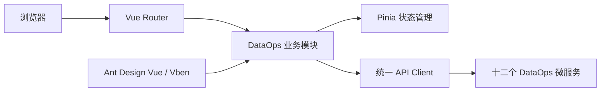

## 技术栈

- Vue 3 + TypeScript
- Vite + Turbo
- Ant Design Vue + Vben Admin
- Pinia + Vue Router
- pnpm 9.15.7

## 快速开始

### 环境要求

- Node.js 20+
- pnpm 9.15.7

### 本地开发

```bash
corepack enable
pnpm install
pnpm dev:antd
```

### 生产构建

```bash
pnpm build:antd
```

部署前请根据目标环境检查 `apps/web-antd` 下的环境变量和 API 地址配置。不要将真实密钥、生产令牌或服务器凭据提交到仓库。

## 在线体验

- 访问地址：<http://www.xnetdataops.synapxnet.cn>
- 演示手机号：`12345678900`
- 演示验证码：`000000`

固定验证码仅用于公开演示。生产部署应接入安全的身份认证与验证码服务。

## SynapXnet 开源生态

本项目属于 SynapXnet 开源项目矩阵。访问 [OpenXnet](https://openxnet.synapxnet.com) 获取更多团队项目与社区信息。

## 参与贡献

欢迎提交 Issue 与 Pull Request。新增业务页面时请遵循现有路由、权限、状态管理和请求层约定，并同步维护必要的类型定义。

## 开源许可

本项目基于 [MIT License](./LICENSE) 开源。前端采用 [Vue Vben Admin 框架](https://github.com/vbenjs/vue-vben-admin)，并依法保留上游项目的 MIT 版权与许可声明。
